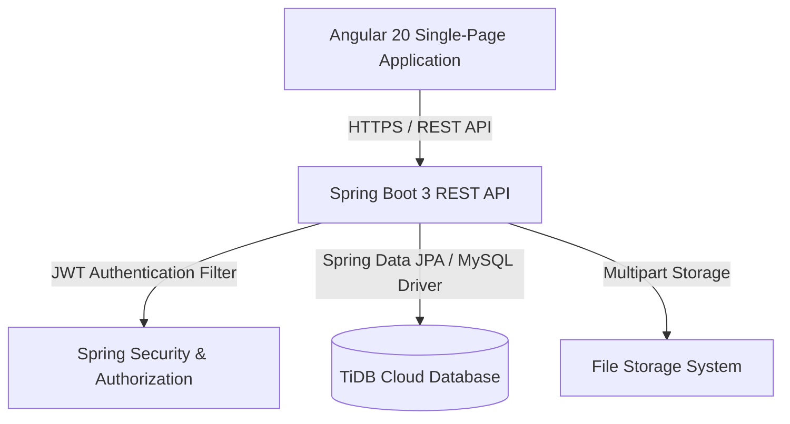

# AgileFlow – Project Management System

AgileFlow is a full-stack, enterprise-ready project management system designed around Agile software development workflows. It bridges project planning and day-to-day issue tracking by allowing software teams to manage projects, plan iterative sprints, assign tasks, log work hours, and track progress through role-based dashboards.

---

## Live Demo

- **Live Frontend Application**: [https://agileflow-org.netlify.app](https://agileflow-org.netlify.app)
- **Live Backend API Service**: [https://agileflow-backend-popr.onrender.com](https://agileflow-backend-popr.onrender.com)

---

## Overview

AgileFlow provides a structured platform for modern software development teams to execute projects iteratively:

- **Agile Workflow Support**: Organize work into high-level Projects, plan time-boxed Sprints, create granular Issues (tasks, bugs, stories), and track resolution progress.
- **Collaborative Execution**: Assign issue owners, hold threaded discussions via comments, upload file attachments, and log time spent on task execution.
- **Role-Tailored Dashboards**: Present relevant metrics to Admins, Project Managers, and Developers based on their operational focus.

---

## Features

### Authentication & Security
- **JWT-Based Authentication**: Secure authentication pipeline issuing signed JWT tokens upon login.
- **Role-Based Access Control (RBAC)**: Enforced endpoint-level authorization matching user roles (`ADMIN`, `PROJECT_MANAGER`, `DEVELOPER`).

### Project Management
- **Project Catalog**: Create and oversee projects with custom keys, descriptions, start/end dates, and status fields.
- **Project Members**: Assign project members with designated roles to control project-level access.

### Sprint Management
- **Iterative Sprints**: Create and manage sprints for projects with start dates, end dates, and sprint goals.
- **Sprint Lifecycle**: Transition sprint states (e.g. Planned, Active, Completed) and monitor sprint velocity.

### Issue Tracking
- **Issue Lifecycle**: Create, edit, and track issues categorized by type (Task, Bug, Story), priority (Low, Medium, High, Urgent), and status (To Do, In Progress, In Review, Done).
- **Assignments & Relationships**: Assign issues to developers, link issues to specific sprints and projects.
- **Audit History**: Track changes across issue fields over time.

### Collaboration & Worklogs
- **Threaded Comments**: Add and review comments on individual issues to maintain technical discussions.
- **Attachments**: Upload and download attachments associated with issues.
- **Worklogs**: Log hours worked per issue with activity descriptions and timestamps.

### Reporting & Analytics
- **Role-Based Dashboards**: Custom dashboard views aggregated for Admins, Project Managers, and Developers.
- **Project Analytics**: Real-time breakdowns of issue status distributions, priority metrics, sprint velocity, and worklog summaries.

### Activity Stream & Notifications
- **Activity Feed**: Audit log recording project actions and state changes across the system.
- **Notifications**: In-app notifications alerting users to issue assignments and project activities.

---

## User Roles

Authorization is enforced at both the API layer (Spring Security) and frontend route guards.

| Role | Access & Responsibilities |
|---|---|
| **Admin** | System-wide administrative access. Manages user accounts, assigns global roles, creates projects, oversees all sprints, issues, and accesses the Admin Dashboard. |
| **Project Manager** | Manages assigned projects and project members, creates and manages sprints, tracks project analytics/reports, manages issues, and accesses the PM Dashboard. |
| **Developer** | Operational access. Views assigned projects and sprints, creates and updates assigned issues, logs work hours, posts comments, uploads attachments, and accesses the Developer Dashboard. |

---

## Technology Stack

| Layer | Technology |
|---|---|
| **Frontend** | Angular 20, TypeScript, HTML5, Vanilla CSS, Bootstrap Icons |
| **Backend** | Spring Boot 3.5.15, Java 17, Spring Security, Spring Data JPA / Hibernate |
| **Database** | TiDB Cloud (MySQL-compatible) |
| **Authentication** | JSON Web Token (JWT) |
| **Build Tools** | Maven (Backend), Angular CLI / npm (Frontend) |
| **Containerization** | Docker (Multi-stage build) |
| **Deployment** | Render (Backend Docker container), Netlify (Frontend), TiDB Cloud (Database) |

---

## Architecture

AgileFlow follows a decoupled client-server architecture with a RESTful API backend and a single-page frontend application.



- **Frontend**: Single-Page Application built with Angular, utilizing HTTP interceptors for automatic JWT header injection and client-side route guards for RBAC.
- **Backend**: Layered Spring Boot application (Controllers, Services, Repositories, Entities) using Spring Security filters for stateless JWT validation.
- **Database**: Relational database schema hosted on TiDB Cloud, managed via Spring Data JPA entities and automatic schema updates.

---

## Project Structure

```text
agileflow/
├── agileflow-frontend/              # Angular Frontend Application
│   ├── src/
│   │   ├── app/
│   │   │   ├── core/                # Guards, Interceptors, Core Services
│   │   │   ├── features/            # Auth, Projects, Issues, Sprints, Dashboard
│   │   │   └── shared/              # Shared UI components & models
│   │   └── environments/            # Dev and Production environment configs
│   ├── angular.json
│   └── package.json
│
├── agileflow-backend/               # Spring Boot Backend Application
│   ├── src/main/java/com/agileflow/agileflow_backend/
│   │   ├── auth/                    # Auth controller, JWT service, user entities
│   │   ├── project/                 # Project controllers & services
│   │   ├── sprint/                  # Sprint management module
│   │   ├── issue/                   # Issue tracking & history
│   │   ├── dashboard/               # Role-specific dashboard services
│   │   ├── config/                  # SecurityConfig & Data Initializer
│   │   └── security/                # Custom UserDetailsService & JWT filters
│   ├── src/main/resources/
│   │   ├── application.properties   # Main Spring config
│   │   └── application-prod.properties # Production profile config
│   ├── Dockerfile                   # Multi-stage Docker build config
│   ├── .dockerignore
│   └── pom.xml
│
└── README.md                        # Root Documentation
```

---

## Local Development Setup

### Prerequisites
- **Java 17** JDK
- **Node.js** (v18+) & **npm**
- **MySQL** or local database instance

### 1. Database Setup
Create a database named `agileflow_db` in your local MySQL instance.

### 2. Backend Setup
```bash
cd agileflow-backend
# Set environment variables or configure application-dev.properties
mvn clean package -DskipTests
mvn spring-boot:run
```
The backend API will run at `http://localhost:8080/api/v1`.

### 3. Frontend Setup
```bash
cd agileflow-frontend
npm install
npm start
```
The frontend will be available at `http://localhost:4200`.

---

## Production Deployment

- **Backend**: Containerized via [`agileflow-backend/Dockerfile`](file:///e:/agileflow/agileflow-backend/Dockerfile) and deployed on **Render** with environment variables (`DB_HOST`, `DB_PORT`, `DB_NAME`, `DB_USER`, `DB_PASSWORD`, `JWT_SECRET`, `SPRING_PROFILES_ACTIVE=prod`).
- **Frontend**: Built using `ng build` and hosted on **Netlify** configured with SPA route redirects.
