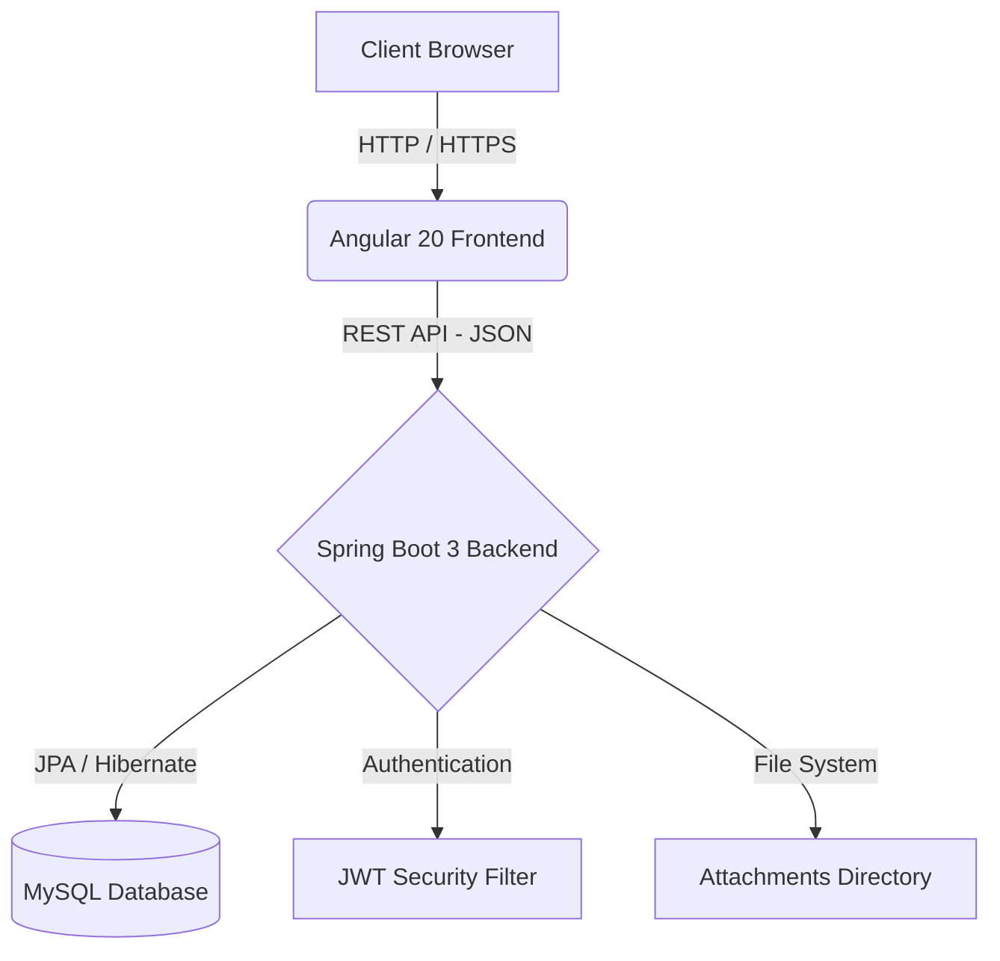

<div align="center">
  
# AgileFlow – Enterprise Agile Project Management System

**A comprehensive, enterprise-ready Agile Project Management System designed to streamline project workflows, manage sprints, track issues, and collaborate efficiently.**


</div>

---

## 📖 About

**AgileFlow** is a robust project management solution tailored for modern software development teams. Built to address the complexities of managing enterprise-scale projects, AgileFlow bridges the gap between high-level project planning and day-to-day issue tracking.

It provides teams with a centralized platform to plan sprints, assign tasks, log work, and track real-time progress through intuitive role-based dashboards. Whether you are an Admin overseeing the system, a Project Manager steering the project lifecycle, or a Developer resolving tickets, AgileFlow equips you with the precise tools required for your role.

---

## ✨ Features

AgileFlow is packed with features that cover the entire agile development lifecycle:

- **🔐 Authentication & Security**: Secure JWT-based Authentication with strict Role-Based Access Control.
- **📁 Project Management**: Create, update, and oversee projects while managing dedicated project members.
- **🏃 Sprint Management**: Plan, execute, and monitor sprints iteratively.
- **🐞 Issue Tracking**: Comprehensive issue lifecycle management including creation, assignment, priority, and status transitions.
- **💬 Comments & Attachments**: Foster team collaboration by discussing issues in threads and attaching relevant project files.
- **⏱️ Worklogs & Activity Feed**: Log time spent on issues and monitor real-time project activities.
- **📜 Issue History**: Maintain a complete audit trail of modifications on every issue.
- **📊 Reports & Dashboard**: Customized, data-rich dashboards for Admins, Project Managers, and Developers.
- **🔔 Notifications**: Stay updated with system alerts regarding assignments and project milestones.
- **🔍 Search**: Efficient keyword-based search across projects and issues.

---

## 🛠️ Technology Stack

### Frontend
- **Framework**: Angular 20
- **Language**: TypeScript
- **Styling**: HTML5, SCSS
- **Routing**: Angular Router

### Backend
- **Framework**: Spring Boot 3.5.15
- **Language**: Java 17
- **Security**: Spring Security & JWT (JSON Web Tokens)
- **Data Access**: Spring Data JPA / Hibernate

### Database
- **Primary Database**: MySQL
- **Driver**: MySQL Connector/J

### Deployment & Tools
- **Containerization**: Docker & Docker Compose
- **Web Server**: Nginx (Frontend)
- **Target Cloud (Frontend)**: Netlify
- **Target Cloud (Backend)**: Render

---

## 🏗️ System Architecture

AgileFlow employs a decoupled, client-server architecture ensuring scalability and maintainability.



---

## 📂 Project Structure

```text
Agile-Flow-Project-Management-System/
├── agileflow-frontend/           # Angular 20 Frontend Application
│   ├── src/
│   │   ├── app/
│   │   │   ├── core/             # Guards, Interceptors, Services
│   │   │   ├── features/         # Modules: auth, projects, issues, dashboard, etc.
│   │   │   └── shared/           # Shared UI components and utilities
│   │   ├── public/               # Static assets
│   │   └── ...
│   ├── Dockerfile                # Nginx Deployment Configuration
│   └── package.json
├── agileflow-backend/            # Spring Boot 3 Backend Application
│   ├── src/main/java/.../
│   │   ├── auth/                 # Authentication & User Management
│   │   ├── project/              # Project & Sprint Management
│   │   ├── issue/                # Issue Tracking & History
│   │   ├── dashboard/            # Role-Specific Dashboards
│   │   ├── analytics/            # Reports & Analytics
│   │   └── ...
│   ├── Dockerfile                # Backend Deployment Configuration
│   └── pom.xml
├── docker-compose.yml            # Local Infrastructure Setup
└── DEPLOYMENT.md                 # Detailed Deployment Guide
```

---

## 🗄️ Database Overview

The system's data model is normalized for efficiency and data integrity:

- **`User` / `Role`**: Manages credentials, profile data, and RBAC (Admin, PM, Developer).
- **`Project`**: Core entity for project details, linked to `ProjectMember`.
- **`Sprint`**: Represents iterative development cycles within a project context.
- **`Issue`**: Tracks tasks, bugs, or user stories assigned to team members.
- **`Comment` / `Attachment`**: Facilitates collaboration on specific issues.
- **`WorkLog`**: Logs time entries for issues.
- **`IssueHistory` / `Activity`**: Maintains audit trails for modifications and broader project events.
- **`Notification`**: System alerts directed to specific users.

---

## 🔌 API Overview

The backend exposes secured, modular REST APIs categorized by domain:

- **Authentication** (`/api/auth/**`): User login and registration.
- **Users** (`/api/users/**`): Profile management and user listing.
- **Projects** (`/api/projects/**`): Full CRUD for projects, member management, and search.
- **Sprints** (`/api/sprints/**`): Sprint planning and status management.
- **Issues** (`/api/issues/**`): Issue creation, updates, transitions, and history.
- **Collaboration** (`/api/comments/**`, `/api/attachments/**`, `/api/worklogs/**`): Issue interactions.
- **Dashboards & Analytics** (`/api/dashboard/**`, `/api/analytics/**`, `/api/reports/**`): Aggregated metrics for different roles.
- **System** (`/api/activities/**`, `/api/notifications/**`): Timelines and user alerts.

---

## 📸 Screenshots


| Login | Dashboard |
|:---:|:---:|
|  |  |

| Projects | Issues |
|:---:|:---:|
|  |  |

---

## 🚀 Installation & Local Setup

### 1. Database Setup
Ensure you have MySQL installed and running. Create a database named `agileflow_db` (or as defined in your `.env`).

### 2. Backend Setup
```bash
cd agileflow-backend
# Make sure to configure application properties or provide a .env file based on .env.example
mvn clean install
mvn spring-boot:run
```
The backend will be available at `http://localhost:8080`.

### 3. Frontend Setup
```bash
cd agileflow-frontend
npm install
npm start
```
The frontend will be available at `http://localhost:4200`.

### 🐳 Running via Docker (Recommended)
You can spin up the entire stack using Docker Compose:
```bash
docker compose up -d --build
```

---

## 🌍 Deployment

AgileFlow is designed to be easily deployed to modern cloud platforms.

### Frontend Deployment (Netlify)
1. Connect your GitHub repository to Netlify.
2. Set the Base directory to `agileflow-frontend`.
3. Set the Build command to `npm run build`.
4. Set the Publish directory to `dist/agileflow-frontend/browser`.
5. Add a `_redirects` file in the `public` folder with `/* /index.html 200` to support Angular's SPA routing.

### Backend Deployment (Render)
1. Create a new Web Service on Render and connect your repository.
2. Set the Root Directory to `agileflow-backend`.
3. Set the Environment to `Java`.
4. Set the Build command to `mvn clean package -DskipTests`.
5. Set the Start command to `java -jar target/agileflow-backend-0.0.1-SNAPSHOT.jar`.
6. Add necessary Environment Variables (e.g., `DB_HOST`, `DB_USER`, `DB_PASSWORD`, `JWT_SECRET`).

---

## 👥 User Roles

| Role | Responsibilities |
|---|---|
| **Admin** | Possesses system-wide access. Responsible for global configurations, user management, and overseeing all projects. |
| **Project Manager (PM)** | Creates and manages projects, plans sprints, allocates resources, tracks overall progress, and views project analytics. |
| **Developer** | Works on assigned issues, transitions issue statuses, logs work hours, and collaborates via comments and attachments. |

---

## 🔑 Demo Credentials

Use the following credentials to explore the application across different roles:

| Role | Email | Password |
|---|---|---|
| **Admin** | `admin@agileflow.com` | `Admin@123` |
| **Project Manager** | `pm@gmail.com` | `manager@1234` |
| **Developer** | `dev@gmail.com` | `dev@1234` |

---

## 🌟 Key Highlights

This project serves as a comprehensive demonstration of:
- **Enterprise Architecture**: Decoupled systems with a robust API gateway.
- **Clean Code**: Adherence to SOLID principles and layered architecture in Spring Boot.
- **Role-Based Security**: Advanced security configurations protecting sensitive endpoints.
- **RESTful APIs**: Standardized, well-structured endpoints with uniform error handling.
- **Modular Design**: Feature-based module organization in Angular for scalability.
- **Production Deployment**: Containerized workflows and ready-to-deploy cloud configurations.

---

## 🔮 Future Improvements

- **External Integrations**: Webhooks for Slack, GitHub, or Jira integration.
- **Advanced Agile Metrics**: Implementation of interactive Burndown and Velocity charts.
- **Email Notifications**: Asynchronous email delivery for critical project updates and assignments.
- **Enhanced Security**: Introduction of Two-Factor Authentication (2FA).

---

## 👨‍💻 Author

**AgileFlow** was conceptualized and developed with a focus on modern software engineering practices.

- **LinkedIn**: [LinkedIn](https://www.linkedin.com/in/jeeva--m/)
- **Email**: (devjeeva.m@gmail.com)

---
